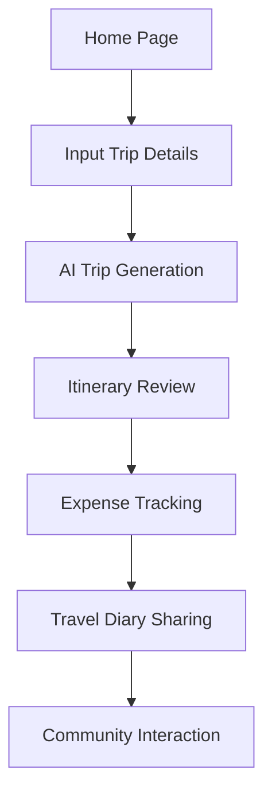

## 1. Product Overview
BudgetVoyage（智省旅行/穷游优选）是一款为预算有限但追求高质量旅行体验的年轻人设计的智能旅行规划应用。
- 核心目标是帮助用户用同样预算获得最好的旅行体验，提供高性价比的旅行方案和真实用户体验。
- 目标用户包括背包客、学生、情侣等预算有限但注重旅行质量的群体，市场价值在于解决旅行预算与体验之间的平衡问题。

## 2. Core Features

### 2.1 User Roles
| Role | Registration Method | Core Permissions |
|------|---------------------|------------------|
| Normal User | Email/Phone + Social Login | Browse, create trips, post reviews, join groups |
| Premium User | In-app purchase | Advanced AI features, offline maps, ad-free experience |

### 2.2 Feature Module
1. **Home Page**: Smart recommendation engine, quick trip planner, real-time deals
2. **Trip Planner**: Detailed itinerary creation, budget management, AI assistant
3. **Discover Page**: Hidden gems, local experiences, food recommendations
4. **Community Page**: Travel diaries, group matching, user reviews
5. **Profile Page**: Personal settings, saved trips, spending history

### 2.3 Page Details
| Page Name | Module Name | Feature description |
|-----------|-------------|---------------------|
| Home Page | Smart Recommendation Engine | Personalized trip suggestions based on budget, duration, destination, and interests. Includes hidden gems and value scores. |
| Home Page | Quick Trip Planner | One-click trip generation with AI assistance, real-time budget estimation. |
| Home Page | Real-time Deals | Curated travel deals, flash sales, and local promotions. |
| Trip Planner | Itinerary Creator | Multi-day itinerary with time optimization, POI recommendations, and budget tracking. |
| Trip Planner | Budget Management | Automatic budget splitting, real-time expense tracking, multi-currency support. |
| Trip Planner | AI Assistant | Chat-based travel assistant for itinerary adjustments, recommendations, and problem-solving. |
| Discover Page | Hidden Gems | Curated list of off-the-beaten-path locations with user reviews and photos. |
| Discover Page | Local Experiences | Authentic local activities and experiences at affordable prices. |
| Discover Page | Food Recommendations | Budget-friendly local restaurants with price ranges and authentic reviews. |
| Community Page | Travel Diaries | User-shared travel journals with detailed expenses and photos. |
| Community Page | Group Matching | Real-time matching for shared accommodation, transportation, and group activities. |
| Community Page | User Reviews | Verified user reviews for hotels, restaurants, and attractions. |
| Profile Page | Personal Settings | Account management, notification preferences, language settings. |
| Profile Page | Saved Trips | Collection of favorite trips and itineraries for future reference. |
| Profile Page | Spending History | Detailed expense reports and spending analytics. |

## 3. Core Process

### User Flow for Trip Planning
1. User opens the app and lands on the Home Page
2. User inputs trip details (budget, duration, destination, interests)
3. App generates personalized itinerary with AI assistance
4. User reviews and adjusts the itinerary
5. User tracks expenses during the trip
6. User shares travel diary and reviews after the trip

## 4. User Interface Design
### 4.1 Design Style
- Primary Color: #3B82F6 (Blue) - represents trust and adventure
- Secondary Color: #10B981 (Green) - represents value and sustainability
- Accent Color: #F59E0B (Orange) - represents energy and excitement
- Button Style: Rounded corners (8px), subtle shadow effects
- Font: Inter for body text, Poppins for headings
- Font Sizes: 12px (caption), 14px (body), 16px (subtitle), 20px (title), 24px (hero)
- Layout Style: Card-based design with generous white space, gradient backgrounds
- Icon Style: Minimalist, line-based icons with subtle animations

### 4.2 Page Design Overview
| Page Name | Module Name | UI Elements |
|-----------|-------------|-------------|
| Home Page | Smart Recommendation Engine | Hero section with animated map background, card-based trip suggestions with value scores, quick filters for budget and interests. |
| Trip Planner | Itinerary Creator | Timeline-based layout, drag-and-drop functionality, color-coded activities, budget indicators. |
| Discover Page | Hidden Gems | Map-based exploration, photo carousels, user review cards, distance indicators. |
| Community Page | Travel Diaries | Grid layout of diary cards, featured stories, interactive filters. |
| Profile Page | Spending History | Chart-based expense visualization, category breakdowns, export options. |

### 4.3 Responsiveness
- Mobile-first design with adaptive layouts
- Touch-optimized interface with large tap targets
- Collapsible navigation for smaller screens
- Optimized map interactions for mobile devices

### 4.4 3D Scene Guidance (if applicable)
- Interactive map with 3D landmarks for key destinations
- Immersive photo galleries with parallax effects
- Animated budget visualization with 3D charts