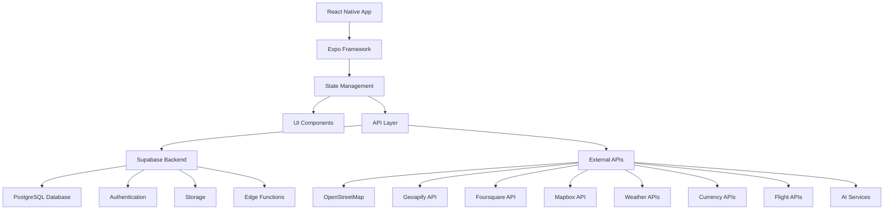
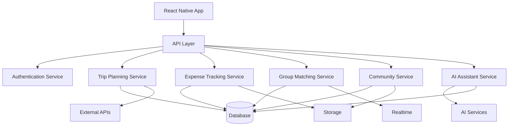
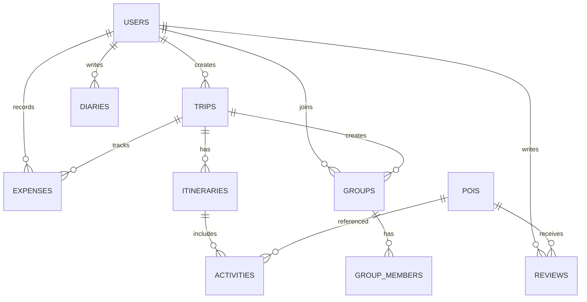

## 1. Architecture Design



## 2. Technology Description

### Frontend
- **Framework**: React Native + Expo (latest version)
- **Language**: TypeScript (strict mode)
- **State Management**: Zustand + TanStack Query (React Query)
- **UI Components**: NativeWind (Tailwind CSS) + Shadcn/ui for React Native
- **Navigation**: React Navigation 6
- **Animation**: React Native Reanimated 3
- **Maps**: React Native Maps + Mapbox
- **Camera**: Expo Camera
- **Notifications**: Expo Notifications
- **Offline Support**: WatermelonDB + AsyncStorage + Expo Offline

### Backend
- **Platform**: Supabase (PostgreSQL + Auth + Storage + Edge Functions)
- **Authentication**: Supabase Auth
- **Database**: PostgreSQL (via Supabase)
- **Storage**: Supabase Storage
- **Serverless Functions**: Supabase Edge Functions

### External Services
- **POI Data**: OpenStreetMap Overpass API, Geoapify Places API, Foursquare Places API
- **Maps**: Mapbox
- **Weather**: Open-Meteo, OpenWeatherMap
- **Currency Exchange**: ExchangeRate-API, Frankfurter
- **Flight Data**: Amadeus Self-Service API, Skyscanner API
- **AI Services**: OpenAI GPT-4o, Claude 3.5, Grok API

## 3. Route Definitions

| Route | Purpose |
|-------|---------|
| / | Home Page with smart recommendations |
| /trip-planner | Trip planning and itinerary creation |
| /discover | Hidden gems and local experiences |
| /community | Travel diaries and group matching |
| /profile | User profile and settings |
| /trip/:id | Trip details and itinerary view |
| /poi/:id | Point of interest details |
| /group/:id | Group matching details |
| /ai-assistant | AI chat-based travel assistant |

## 4. API Definitions

### Frontend API Layer

#### Trip Planning API
```typescript
interface TripPlanRequest {
  destination: string;
  budget: number;
  duration: number;
  travelType: string;
  interests: string[];
  currency: string;
}

interface TripPlanResponse {
  id: string;
  itinerary: DayItinerary[];
  totalBudget: number;
  estimatedExpenses: ExpenseBreakdown;
  recommendations: Recommendation[];
}

interface DayItinerary {
  day: number;
  activities: Activity[];
  budget: number;
}

interface Activity {
  id: string;
  name: string;
  description: string;
  duration: number;
  cost: number;
  category: string;
  location: Location;
  rating: number;
  valueScore: number;
}
```

#### Expense Tracking API
```typescript
interface ExpenseRequest {
  tripId: string;
  amount: number;
  category: string;
  description: string;
  currency: string;
  date: string;
  receiptImage?: string;
}

interface ExpenseResponse {
  id: string;
  tripId: string;
  amount: number;
  category: string;
  description: string;
  currency: string;
  date: string;
  receiptImage?: string;
}
```

#### Group Matching API
```typescript
interface GroupRequest {
  tripId: string;
  type: 'accommodation' | 'transport' | 'activity';
  budget: number;
  date: string;
  location: string;
  maxParticipants: number;
  description: string;
}

interface GroupResponse {
  id: string;
  tripId: string;
  type: 'accommodation' | 'transport' | 'activity';
  budget: number;
  date: string;
  location: string;
  maxParticipants: number;
  currentParticipants: number;
  description: string;
  participants: User[];
}
```

## 5. Server Architecture Diagram



## 6. Data Model

### 6.1 Data Model Definition



### 6.2 Data Definition Language

#### Users Table
```sql
CREATE TABLE users (
  id UUID PRIMARY KEY DEFAULT gen_random_uuid(),
  email TEXT UNIQUE NOT NULL,
  name TEXT NOT NULL,
  avatar_url TEXT,
  bio TEXT,
  travel_style TEXT[],
  is_premium BOOLEAN DEFAULT FALSE,
  created_at TIMESTAMP WITH TIME ZONE DEFAULT NOW(),
  updated_at TIMESTAMP WITH TIME ZONE DEFAULT NOW()
);
```

#### Trips Table
```sql
CREATE TABLE trips (
  id UUID PRIMARY KEY DEFAULT gen_random_uuid(),
  user_id UUID REFERENCES users(id),
  name TEXT NOT NULL,
  destination TEXT NOT NULL,
  start_date DATE NOT NULL,
  end_date DATE NOT NULL,
  total_budget DECIMAL(10,2) NOT NULL,
  currency TEXT NOT NULL DEFAULT 'USD',
  travel_type TEXT NOT NULL,
  interests TEXT[],
  status TEXT DEFAULT 'planned',
  created_at TIMESTAMP WITH TIME ZONE DEFAULT NOW(),
  updated_at TIMESTAMP WITH TIME ZONE DEFAULT NOW()
);
```

#### Itineraries Table
```sql
CREATE TABLE itineraries (
  id UUID PRIMARY KEY DEFAULT gen_random_uuid(),
  trip_id UUID REFERENCES trips(id),
  day_number INTEGER NOT NULL,
  date DATE NOT NULL,
  day_budget DECIMAL(10,2) NOT NULL,
  notes TEXT,
  created_at TIMESTAMP WITH TIME ZONE DEFAULT NOW(),
  updated_at TIMESTAMP WITH TIME ZONE DEFAULT NOW()
);
```

#### Activities Table
```sql
CREATE TABLE activities (
  id UUID PRIMARY KEY DEFAULT gen_random_uuid(),
  itinerary_id UUID REFERENCES itineraries(id),
  poi_id UUID,
  name TEXT NOT NULL,
  description TEXT,
  start_time TIME NOT NULL,
  duration INTEGER NOT NULL,
  cost DECIMAL(10,2) NOT NULL,
  category TEXT NOT NULL,
  location JSONB NOT NULL,
  rating DECIMAL(3,1),
  value_score DECIMAL(3,1),
  created_at TIMESTAMP WITH TIME ZONE DEFAULT NOW(),
  updated_at TIMESTAMP WITH TIME ZONE DEFAULT NOW()
);
```

#### Expenses Table
```sql
CREATE TABLE expenses (
  id UUID PRIMARY KEY DEFAULT gen_random_uuid(),
  trip_id UUID REFERENCES trips(id),
  user_id UUID REFERENCES users(id),
  amount DECIMAL(10,2) NOT NULL,
  currency TEXT NOT NULL,
  category TEXT NOT NULL,
  description TEXT,
  date TIMESTAMP WITH TIME ZONE NOT NULL,
  receipt_image TEXT,
  created_at TIMESTAMP WITH TIME ZONE DEFAULT NOW(),
  updated_at TIMESTAMP WITH TIME ZONE DEFAULT NOW()
);
```

#### POIs Table
```sql
CREATE TABLE pois (
  id UUID PRIMARY KEY DEFAULT gen_random_uuid(),
  osm_id TEXT,
  name TEXT NOT NULL,
  address TEXT,
  location JSONB NOT NULL,
  category TEXT NOT NULL,
  price_level INTEGER,
  rating DECIMAL(3,1),
  value_score DECIMAL(3,1),
  description TEXT,
  images TEXT[],
  created_at TIMESTAMP WITH TIME ZONE DEFAULT NOW(),
  updated_at TIMESTAMP WITH TIME ZONE DEFAULT NOW()
);
```

#### Reviews Table
```sql
CREATE TABLE reviews (
  id UUID PRIMARY KEY DEFAULT gen_random_uuid(),
  user_id UUID REFERENCES users(id),
  poi_id UUID REFERENCES pois(id),
  trip_id UUID REFERENCES trips(id),
  rating INTEGER NOT NULL,
  value_score INTEGER NOT NULL,
  comment TEXT NOT NULL,
  images TEXT[],
  created_at TIMESTAMP WITH TIME ZONE DEFAULT NOW(),
  updated_at TIMESTAMP WITH TIME ZONE DEFAULT NOW()
);
```

#### Diaries Table
```sql
CREATE TABLE diaries (
  id UUID PRIMARY KEY DEFAULT gen_random_uuid(),
  user_id UUID REFERENCES users(id),
  trip_id UUID REFERENCES trips(id),
  title TEXT NOT NULL,
  content TEXT NOT NULL,
  images TEXT[],
  total_expense DECIMAL(10,2),
  is_public BOOLEAN DEFAULT TRUE,
  created_at TIMESTAMP WITH TIME ZONE DEFAULT NOW(),
  updated_at TIMESTAMP WITH TIME ZONE DEFAULT NOW()
);
```

#### Groups Table
```sql
CREATE TABLE groups (
  id UUID PRIMARY KEY DEFAULT gen_random_uuid(),
  trip_id UUID REFERENCES trips(id),
  creator_id UUID REFERENCES users(id),
  type TEXT NOT NULL,
  name TEXT NOT NULL,
  description TEXT,
  budget DECIMAL(10,2) NOT NULL,
  date TIMESTAMP WITH TIME ZONE NOT NULL,
  location JSONB NOT NULL,
  max_participants INTEGER NOT NULL,
  current_participants INTEGER DEFAULT 1,
  status TEXT DEFAULT 'open',
  created_at TIMESTAMP WITH TIME ZONE DEFAULT NOW(),
  updated_at TIMESTAMP WITH TIME ZONE DEFAULT NOW()
);
```

#### Group Members Table
```sql
CREATE TABLE group_members (
  id UUID PRIMARY KEY DEFAULT gen_random_uuid(),
  group_id UUID REFERENCES groups(id),
  user_id UUID REFERENCES users(id),
  joined_at TIMESTAMP WITH TIME ZONE DEFAULT NOW()
);
```

### 6.3 Supabase Edge Functions

#### AI Trip Planner Function
```typescript
// Function to generate trip itinerary using AI
export default async (request: Request) => {
  const { destination, budget, duration, interests } = await request.json();
  
  // Call AI API (OpenAI, Claude, or Grok)
  const aiResponse = await fetchAIRecommendations({
    destination,
    budget,
    duration,
    interests
  });
  
  // Process and format response
  const itinerary = processAIResponse(aiResponse);
  
  return new Response(JSON.stringify(itinerary), {
    headers: { 'Content-Type': 'application/json' },
  });
};
```

#### Receipt OCR Function
```typescript
// Function to extract expense data from receipt images
export default async (request: Request) => {
  const { imageUrl } = await request.json();
  
  // Call GPT-4o Vision or Google Vision API
  const ocrResult = await processReceiptImage(imageUrl);
  
  return new Response(JSON.stringify(ocrResult), {
    headers: { 'Content-Type': 'application/json' },
  });
};
```

#### Real-time Deals Function
```typescript
// Function to fetch and process real-time travel deals
export default async (request: Request) => {
  const { destination, budget, dates } = await request.json();
  
  // Fetch deals from various sources
  const deals = await fetchTravelDeals({
    destination,
    budget,
    dates
  });
  
  return new Response(JSON.stringify(deals), {
    headers: { 'Content-Type': 'application/json' },
  });
};
```